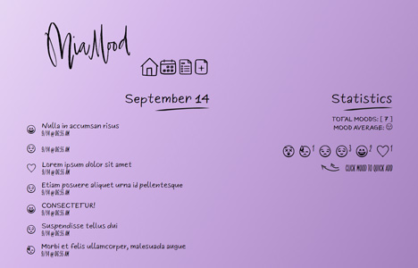
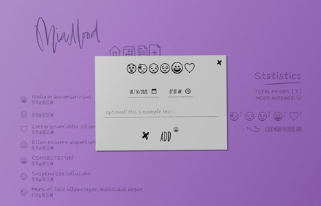

Essa página está em  Português.
To view this page in  English, [click here](./README.md).

---

#  MiaMood


O MiaMood é uma atualização do [MiaMood-MoodTracker](https://github.com/miaslls/MiaMood-MoodTracker#readme), com um sistema de estatísticas de humor aprimorado. A pesquisa por data facilita a recuperação de registros específicos, e um modal de cadastro/atualização de humor otimiza a interação do usuário. Esta versão representa uma notável evolução tecnológica em relação à anterior, oferecendo uma ferramenta mais abrangente para o acompanhamento da saúde emocional.

## 🔗 Demo

- [miamood-02.camilasalles.dev](https://miamood-02.camilasalles.dev/)

## 🖼️ Screenshots

[](assets/img/screenshot-01.jpg)

[](assets/img/screenshot-02.jpg)

## &nbsp; Backend

- [MiaMood-server](https://github.com/miaslls/MiaMood-server#readme)

## ⚙️ Instalação

Clone the project

```bash
> git clone https://github.com/miaslls/MiaMood.git
```

Go to the project directory

```bash
> cd MiaMood
```

Install dependencies

```bash
> npm install
```

Run the project

```bash
> npm run start
```

## 👩‍💻 Autoria

- [@miaslls](https://www.github.com/miaslls)

## 📑 Projetos Relacionados

- [MiaMood-MoodTracker](https://github.com/miaslls/MiaMood-MoodTracker#readme)

## 🫶 Aquele Abraço

- [@woodcutter](https://www.dafont.com/es/woodcutter-manero.d3980)
- [@khushmeen](https://khushmeen.com/icons)
- [flaticon](https://www.flaticon.com/)
