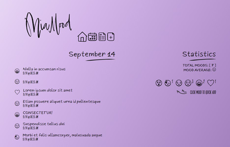
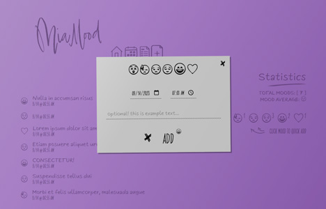

This page is in  English.
Para visualizar essa página em  Português, [clique aqui](./README-ptbr.md).

---

#  MiaMood


MiaMood is an upgraded version of [MiaMood-MoodTracker](https://github.com/miaslls/MiaMood-MoodTracker#readme), featuring an enhanced mood statistics system. Date-based search simplifies the retrieval of specific records, and a mood registration/update modal optimizes user interaction. This version represents a notable technological evolution compared to the previous one, providing a more comprehensive tool for emotional health tracking.

## 🔗 Demo

- [miamood-02.camilasalles.dev](https://miamood-02.camilasalles.dev/)

## 🖼️ Screenshots

[](assets/img/screenshot-01.jpg)

[](assets/img/screenshot-02.jpg)

##   Backend

- [MiaMood-server](https://github.com/miaslls/MiaMood-server#readme)

## ⚙️ Install and Run

Clone the project

```bash
> git clone https://github.com/miaslls/MiaMood.git
```

Go to the project directory

```bash
> cd MiaMood
```

Install dependencies

```bash
> npm install
```

Run the project

```bash
> npm run start
```

## 👩‍💻 Authors

- [@miaslls](https://www.github.com/miaslls)

## 📑 Related Projects

- [MiaMood-MoodTracker](https://github.com/miaslls/MiaMood-MoodTracker#readme)

## 🫶 Acknowledgements

- [@woodcutter](https://www.dafont.com/es/woodcutter-manero.d3980)
- [@khushmeen](https://khushmeen.com/icons)
- [flaticon](https://www.flaticon.com/)
